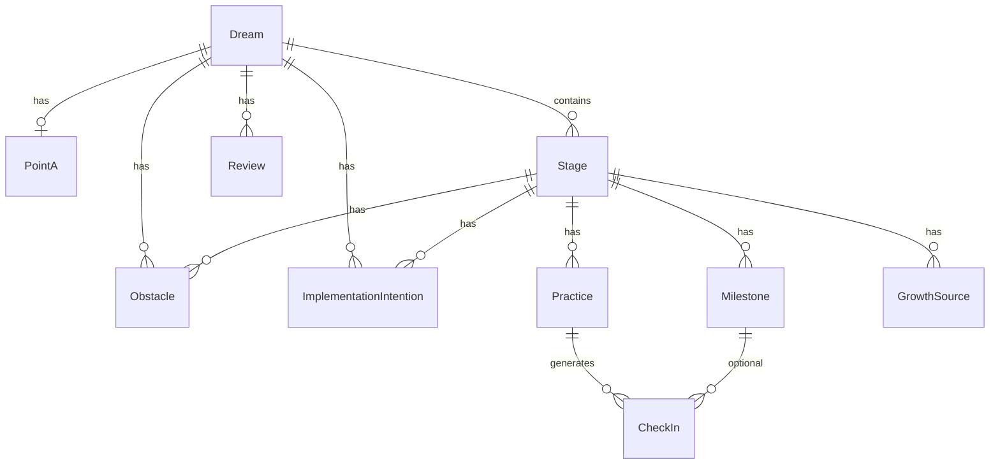

# Data model

Логическая модель MVP. Выбор БД/схемы хранения — позже; здесь сущности и связи.

См. также: [glossary.md](./glossary.md), [methodology.md](./methodology.md).

## Диаграмма связей

## Сущности

### Dream

Глобальная цель-ориентир.

| Поле | Тип | Описание |
| --- | --- | --- |
| id | string | Уникальный идентификатор |
| title | string | Название мечты |
| why | string | Зачем она нужна |
| outcomeVision | string | Образ результата |
| horizon | string \| date | Горизонт (свободный текст или дата) |
| context | string? | Правила среды / ограничения мира цели |
| status | enum | `draft` \| `active` \| `paused` \| `achieved` \| `abandoned` |
| createdAt | datetime | |
| updatedAt | datetime | |

### PointA

Честный старт. Один на мечту (1:1).

| Поле | Тип | Описание |
| --- | --- | --- |
| id | string | |
| dreamId | string | FK → Dream |
| skills | string | Что уже умею |
| resources | string | Ресурсы (время, деньги, люди, инструменты) |
| constraints | string | Ограничения |
| notes | string? | Свободные заметки |
| capturedAt | datetime | Когда зафиксировали |

### Stage

Ступень лестницы.

| Поле | Тип | Описание |
| --- | --- | --- |
| id | string | |
| dreamId | string | FK → Dream |
| order | number | Порядок на лестнице (1…n) |
| title | string | |
| objective | string | Качественный результат этапа (OKR Objective) |
| exitCriteria | string | Критерии выхода (definition of done) |
| status | enum | `planned` \| `active` \| `completed` |
| createdAt | datetime | |
| updatedAt | datetime | |

Инвариант MVP: у одной мечты не больше одного Stage со статусом `active`.

### Milestone

Рубеж внутри этапа.

| Поле | Тип | Описание |
| --- | --- | --- |
| id | string | |
| stageId | string | FK → Stage |
| title | string | |
| successMetric | string | Как измерить «готово» (SMART) |
| dueAt | datetime? | Опциональный срок |
| status | enum | `open` \| `done` |
| completedAt | datetime? | |
| order | number? | |

### Practice

Повторяемая закалка.

| Поле | Тип | Описание |
| --- | --- | --- |
| id | string | |
| stageId | string | FK → Stage |
| title | string | |
| frequency | enum | `daily` \| `weekly` |
| cue | string? | Когда/где (habit cue) |
| focus | string? | На что направлена deliberate practice |
| whyForStage | string? | Связь с objective этапа |
| status | enum | `active` \| `paused` \| `retired` |
| createdAt | datetime | |

### CheckIn

Отметка выполнения.

| Поле | Тип | Описание |
| --- | --- | --- |
| id | string | |
| practiceId | string? | FK → Practice (основной сценарий) |
| milestoneId | string? | FK → Milestone (если отмечаем рубеж отдельно) |
| date | date | Локальная дата |
| status | enum | `done` \| `skipped` |
| note | string? | |
| createdAt | datetime | |

Инвариант: хотя бы одно из `practiceId` / `milestoneId` задано.  
Уникальность (желательно): одна отметка на пару (practiceId, date).

### GrowthSource

Источник роста («учитель/знание»).

| Поле | Тип | Описание |
| --- | --- | --- |
| id | string | |
| stageId | string | FK → Stage |
| title | string | |
| type | enum | `book` \| `course` \| `mentor` \| `practice` \| `ai` \| `other` |
| url | string? | |
| notes | string? | |

### Obstacle

Препятствие (WOOP).

| Поле | Тип | Описание |
| --- | --- | --- |
| id | string | |
| dreamId | string? | |
| stageId | string? | |
| description | string | |

Привязка: к мечте и/или к этапу (хотя бы один FK).

### ImplementationIntention

План «если → то».

| Поле | Тип | Описание |
| --- | --- | --- |
| id | string | |
| dreamId | string? | |
| stageId | string? | |
| ifCondition | string | Если… |
| thenAction | string | …то… |
| obstacleId | string? | Опциональная связь с Obstacle |

### Review

Еженедельный обзор.

| Поле | Тип | Описание |
| --- | --- | --- |
| id | string | |
| dreamId | string | FK → Dream |
| weekStart | date | Начало недели |
| worked | string | Что сработало |
| blocked | string | Что мешало |
| nextChange | string | Что меняем |
| learningUsed | string? | Заметка: во что ушли окна (или куда ушло время) |
| learningWindows | enum? | `none` \| `missed` \| `used` — структурированный ответ про окна |
| weekLessonTouch | enum? | `no_lesson` \| `missed` \| `touched` \| `done` — прогресс по уроку недели |
| weekLessonSnapshot | string? | Снимок урока наставника на момент обзора |
| statsSnapshot | object? | Число check-ins, закрытых milestone и т.п. |
| createdAt | datetime | |

## Вычисляемые понятия (не обязательно хранить)

- **Stage progress** — доля `Milestone` в статусе `done` (и/или чеклист exitCriteria).
- **Practice streak** — подряд идущие `done` CheckIn по `daily` практике (UI-сигнал).
- **Active ladder position** — Dream + active Stage + сегодняшние Practice.

## Хранение MVP

Ожидаемый объём данных одного пользователя крошечный (одна мечта, единицы этапов, десятки практик/отметок).

**Решение (см. [ADR 0002](./decisions/0002-localstorage-character-backup.md)):**

- Живые данные: `localStorage`, ключ `singularity.appData.v1`
- Бэкап персонажа: JSON-файл (не код репозитория)
- Импорт: полная замена данных

Это сейв прогресса в приложении, а не бэкап проекта Singularity.
